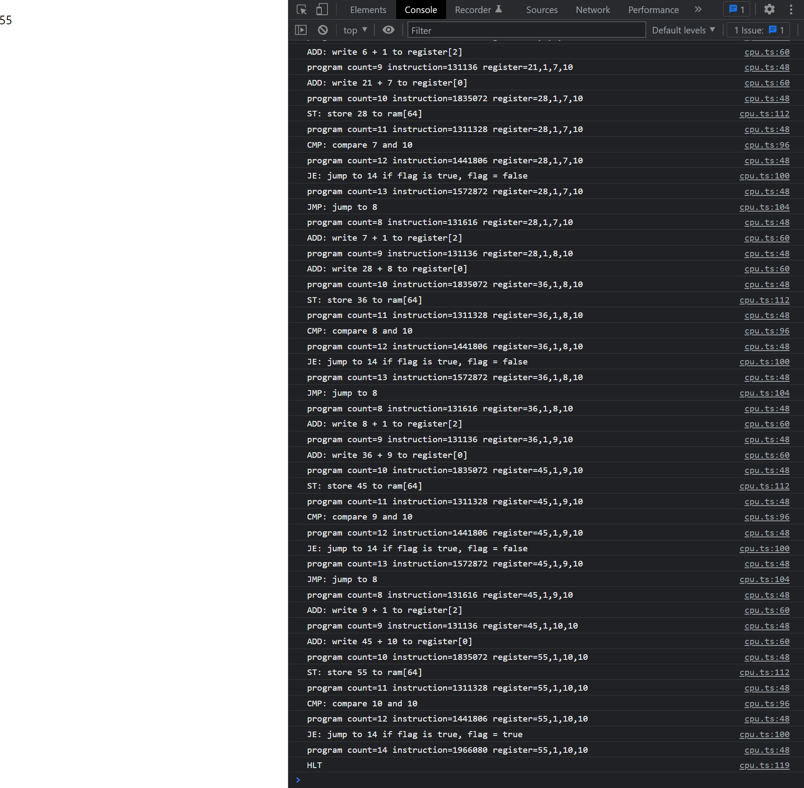

# react-cpu

## 1 Create React App

[Create React App](https://create-react-app.dev/)を利用して新しいReactアプリケーションを作成する

```
npx create-react-app react-cpu --template typescript
```

作成されたアプリケーションを起動する

```
cd react-cpu
npm start
```

localhost:3000でアプリケーションが起動する

